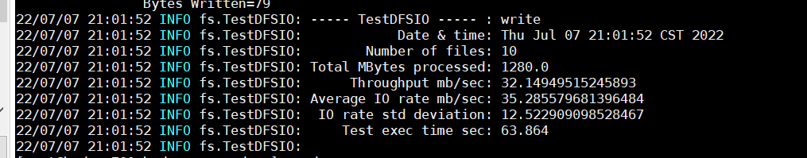
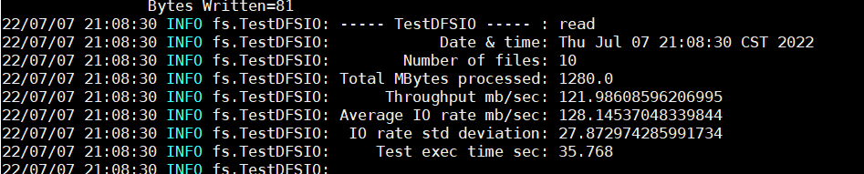
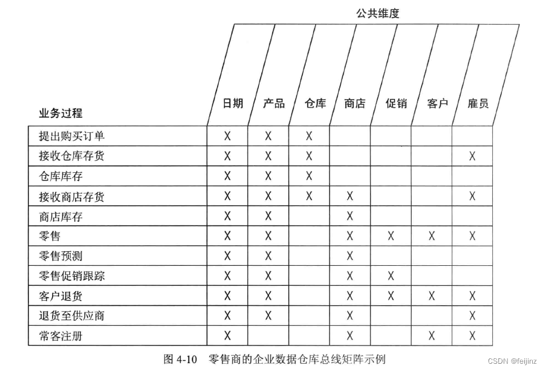
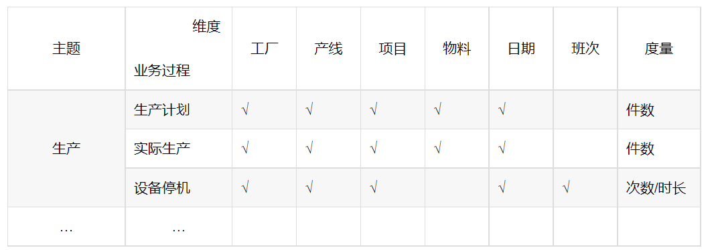
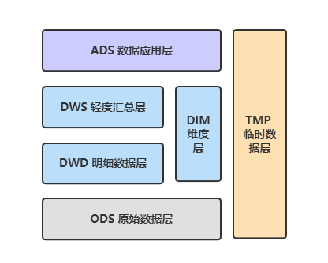

# data_warehouse

数据仓库学习

## 大数据集群环境

### 集群配置

|节点|单节点磁盘|磁盘总和|单节点内存|内存总和| 单节点cpu(物理核) | cpu总和 |
|---|---|---|---|---|-------------|-------|
|3|36.1G|108.3G|8G|24G| 8           | 24    ||

### 参数调优

#### hdfs 调优

|参数| 调优                                                       | 作用                                       |
|---|----------------------------------------------------------|------------------------------------------|
|dfs.namenode.handler.count| python -c 'import math ; print int(math.log(3) * 20)'=21 | 指定NameNode 的服务器线程的数量,改不了最小30             |
| fs.trash.interval | 3h                                                       | 保留被误操作删除的 hdfs 上文件的时间                    |
| dfs.replication | 1                                                        | hdfs存放副本数                                |
| dfs.datanode.du.reserved | 2.1G                                                     | 设置磁盘容量预留多少的配置，防止hdfs磁盘写满导致系统或其他程序磁盘不足的情况 |

#### yarn 调优
1. 默认服务器物理核和虚拟核的转换比例是1:2, 8个物理core的服务器也就是拥有16虚拟vcore ，取80%，即12
2. 因为该节点还存在其他服务，故需预留内存 10%，即 单节点以供yarn调度内存：8*0.9=7.2 G
3. cloudera公司做过性能测试, 对于单任务，如果cpu大于等于5之后, cpu利用率反而不是很好（固定经验值），建议设置为4
4. 综合memory+vcore计算，vcore=4，container=3（12/4）；内存分配：7.2/3=2.4 G
5. 在yarn上运行程序时每个task都是在独立的Container中运行的
6. 服务器逻辑CPU个数查看：cat /proc/cpuinfo| grep "processor"| wc -l

|参数| 调优                                        | 作用    |
|---|-------------------------------------------|-------|
|yarn.nodemanager.resource.memory-mb| 7.2G                                      |表示yarn在该节点上可使用的物理内存总量，给服务器预留15%-20%|
|yarn.nodemanager.resource.cpu-vcores| 12                                        |服务器最多分配给nodemanager使用的虚拟核数|
|yarn.scheduler.minimum-allocation-vcores| 1                                         |一个container最少占用vcore数|
|yarn.scheduler.maximum-allocation-vcores| 4                                         |一个container最多占用vcore数|
|yarn.scheduler.minimum-allocation-mb| 512M                                      |单个任务可申请的最少物理内存|
|yarn.scheduler.maximum-allocation-mb| 2.4G                                      |单个任务可申请的最多物理内存|
|mapreduce.map.memory.mb| 2.4G                                      |一个MapTask可使用的资源上限，如果MapTask实际使用的资源量超过该值，则会被强制杀死，其值不要超过yarn.scheduler.maximum-allocation-mb|
|mapreduce.reduce.memory.mb| 2.4G                                      |一个 ReduceTask 可使用的资源上限。如果 ReduceTask 实际使用的资源量超过该值，则会被强制杀死，其值不要超过yarn.scheduler.maximum-allocation-mb|
|mapreduce.map.cpu.vcores| 4                                         |每个 MapTask 可使用的最多 cpu core 数目|
|mapreduce.reduce.cpu.vcores| 4                                         |每个 ReduceTask 可使用的最多 cpu core 数目|
|mapreduce.reduce.shuffle.parallelcopies| 10                                        |每个 Reduce 去 Map 中取数据的并行数|
|mapreduce.task.io.sort.mb| 200M                                      |   Shuffle环形缓冲区大小，默认100M;调大会减少环形缓冲区的溢写次数，减少磁盘IO，加快map处理速度 |
| mapreduce.map.sort.spill.percent | 90%                                       |      环形缓冲区溢写的阈值，默认80% |
| mapreduce.map.output.compress | true                                      |       MAP输出压缩 |
| mapreduce.map.output.compress.codec | org.apache.hadoop.io.compress.SnappyCodec |  压缩类型 |
| mapreduce.job.reduce.slowstart.completedmaps | 0.7/0.8                                   |  当MAP完成多少后，申请REDUCE资源开始执行REDUCE  |

#### hive 参数调优
|参数| 调优                                                | 作用    |
|---|---------------------------------------------------|-------|
|hive.auto.convert.join|true|在join问题上，让小表放在左边 去左链接（left join）大表，这样可以有效的减少内存溢出错误发生的几率，即 小表自动选择Mapjoin|

## 大数据集群性能测试
### 写性能测试
1. CDH 测试包目录：/opt/cloudera/parcels/CDH/lib/hadoop-mapreduce
2. 执行命令：hadoop jar hadoop-mapreduce-client-jobclient-2.6.0-cdh5.16.2-tests.jar TestDFSIO -write -nrFiles 10 -fileSize 128MB
3. 测试内容：向 HDFS 集群写 10 个 128M 的文件
4. 测试结果：

### 读性能测试
1. CDH 测试包目录：/opt/cloudera/parcels/CDH/lib/hadoop-mapreduce
2. 执行命令：hadoop jar hadoop-mapreduce-client-jobclient-2.6.0-cdh5.16.2-tests.jar TestDFSIO -read -nrFiles 10 -fileSize 128MB
3. 测试内容：读取 HDFS 集群 10 个 128M 的文件
4. 测试结果：

### 删除测试数据
1. 执行命令：hadoop jar hadoop-mapreduce-client-jobclient-2.6.0-cdh5.16.2-tests.jar TestDFSIO -clean

### 测试 Mapreduce 性能
1. 使用RandomWriter来产生随机数，每个节点运行10个Map任务，每个Map产生大约1G大小的二进制随机数
2. 执行命令：hadoop jar hadoop-mapreduce-examples-2.6.0-cdh5.16.2.jar randomwriter random-data

## 数据仓库构建
### 相关概念
#### 维度表
1. 每一张维表对应现实世界中的一个对象或者概念；例如：用户、商品、日期、地区、公司等
2. 维度表的特征：
    - 维度表有多个属性，列比较多
    - 跟事实表相比，维度表的行数比较少；通常 < 10w 条
    - 内容相对固定，但也会发生变化；如 编码表，行业表

#### 事实表
1. 事实表 紧紧围绕业务过程来设计
2. 在大数据领域的事实表设计中，大量采用退化维度的方式
3. 大数据的事实表模型设计中，考虑更多的是提高下游用户的使用效率，降低数据获取的复杂性，减少关联的表数量
##### 单事务事实表
1. 单事务事实表 针对每个业务过程设计一个事实表
2. 单一业务过程事实较多，同时不同业务过程的事实又不相同，则可以考虑使用单事务事实表，处理更加清晰
3. 单事务事实表对于下游用户而言更容易理解，推荐使用单事务事实表
##### 多事务事实表
1. 多事务事实表 将不同的事实放到同一个事实表中，即同一个事实表包含不同的业务过程
##### 周期快照事实表
1. 快照事实表在确定的间隔内对实体的度量进行抽样，这样可以很容易地研究实体的度量值，而不需要聚集长期的事务历史
2. 例：针对卖家的历史至今的下单和支付金额，无论当天卖家是否下单支付事实，都会给该卖家记录一行
##### 累积快照事实表
1. 对于研究事件之间时间间隔的需求，采用累积快照事实表可以很好的解决
2. 例：统计买家下单到支付的时长、买家支付到卖家发货的时长、买家从下单到确认收货的时长
3. 累积快照事实表解决的最重要的问题是统计不同业务过程之间的时间间隔，建议将每个过程的时间间隔作为事实放在事实表中
4. 对于累积快照事实表，需要将各业务过程对应的事实均放入事实表中 
##### 事实表简介
1. 事实表中每行数据代表一个业务事件，如 下单、支付、退款、评价等
2. 举例：2020年5月21日，王老师在京东花了251块钱买了一瓶香水。
    - 维度表：时间、用户、商品、商家
    - 事实表：251 块钱、一瓶
3. 每个事实表的行包括：具有可加性的数值型度量值，与维度表相关联的外键，通常具有两个或者两个以上的外键
4. 事实表特征：
    - 列数较少，主要是外键id和度量值
    - 跟维度表相比，事实表的行数比较多
    - 经常发生变化，每天会增加很多
    
####　维度退化（退化维度）
1. 将本属于维度表的属性退化至事实表，并剔除原本该维度表
2. 维度退化即没有对应的维度表
3. citycode这种我们也会冗余在事实表里面，但是它有对应的维度表，所以它不是退化维度
4. 当维度表a只有一张事实表在使用时，会将维表a退化维度至事实表中，避免使用时额外的关联

#### 维度退化的使用
1. 一般一对一的维度表最终都会选择退化到事实表中，即一张维度表可能只会关联一张事实表，其他事实表都不会用到，那么为了避免过多的关联，会将这个维度表的属性退化到事实表中
2. 一般一对多的维度表会在 DIM 维度层专门设置维度表，即一张维度表可能会被多张事实表关联，则会将这个维度表单独拎出来

#### 维度模型设计主要步骤
1. 选择业务过程
    - 业务过程 指某一操作的中间过程，如 获取订单这个过程，处理保险索赔这个过程。业务过程事件转换为事实表中的事实，即多数事实表记录某一业务过程的结果
    - 每个业务过程对应企业数据仓库总线矩阵的一行
    - 在实际公司业务中，可将高级搜索划分为一个业务过程，其中多个筛选字段为事实表中的记录内容；根据企业名称查询企业也可作为一业务过程，多张事实表记录该查询后的企业详情及图谱关系
2. 声明粒度
    - 粒度 针对于事实表
    - 粒度 是用于确定某一事实表中的行表示什么的
    - 在同一事实表中不要混用多种不同的粒度 
3. 确认维度
    - 任何情况下都应使维度保持单一，即事实表中的外键关联维表的主键，一个外键只可能关联上一条数据
4. 确认事实
    - 事实表的一行与粒度描述的事件是一对一的关系，即事实表的一行代表一个唯一的粒度事件
    
#### 主题与主题域
1. 主题：指将企业不同业务流程信息进行汇总、分类，然后对其进行分析利用
2. 主题域：把关联紧密但不同的数据主题，交汇融合到一个更大的主题域中，便于数据的管理和应用
3. 主题域的划分
    - 按照业务系统划分：如生产系统、财务系统、人力系统
    - 按照需求划分：如拿销售分析来说，分析过程涉及到的对象有产品、仓库、经销商、顾客等，其中每一个分析对象就是一个数仓主题
    - 按照功能划分：如社交软件中的聊天主题域，会涉及到 用户主题、图片主题、文字主题等
    - 按照部门划分：根据不同的部门划分不同的主题域，人力部门为人力主题域，生产部门为生产主题域
4. 主题域注意事项
    - 为了保证整个数仓体系的健康成长，主题域必须要长期维护，而且不能轻易变动
    - 划分主题域时尽量覆盖业务流程中所有的业务需求
    - 体系中增加新的业务流程时，要及时拓展新的主题域或是自然添加到已有的主题域中
    - 划分主题域时不能总想着一次性解决全部问题，要先明确主题，然后依托主题慢慢发展
    
    
#### 企业数据仓库总线矩阵
1. 企业数据仓库总线矩阵，又称为“总线矩阵”、“业务矩阵”
2. 总线矩阵包含业务过程、公共一致性维度。每行代表一个业务过程，每列表示一个公共维度，还包括业务过程与维度间的联系

3. 扩展总线矩阵，加入主题划分

### 维度建模的实际使用
#### 公司业务的维度表和事实表的划分
1. 针对于公司的业务，其实可以把企业作为实体，相当于电商行业的人；将企业作为一个主维度
2. 可以把一些关联表作为事实表，相当于电商行业的 订单表，支付表等； 如 裁判文书关联表、开庭公告关联表等，又由于如 裁判文书维度 只可能在裁判文书关联表中使用到，开庭公告 维度只可能在开庭公告关联表中使用到；故可将这些维度属性退化至相应的事实表中

#### 基于公司业务制定的数据仓库的分层架构

1. ODS 层（原始数据层）：因公司业务原因，原始数据层可由上游直接给出，无需我们采集接入数据；即 从上游 入库的全量表
2. DWD 层（明细数据层）：明细数据层主要存储一些事实表，该层对数据进行 清洗、规范化，清洗脏数据，规范 状态不一致的、命名不规范 的数据。为了提高明细数据层的易用性，该层会采取一些维度退化的手法，减少事实表和维度表的关联。如上面所提到的，该层会存储一些维度退化后的 裁判文书关联表、开庭公告关联表等。
3. DWS 层（轻度汇总层）：会对 DWD 层的数据进行轻度的汇总，汇总成分析某一主题域的服务数据，一般为宽表。如 切分主题为 企业基本信息 ，企业经营信息等；然后企业基本信息中可能又包含 工商信息、联系方式、股东信息、主要成员、工商变更、企业年报、分支机构、参股控股 这八个维度，可将这八个维度数据汇总为一张宽表。
4. DIM 层（维度层）：对公共维度设置单一层，保证全局维度一致性。如 企业维度、区域代码维度、行业代码维度等
5. TMP 层（临时数据层）：临时表，测试表，或者单次执行后即不再使用的表，不做限制（会定期清理）
